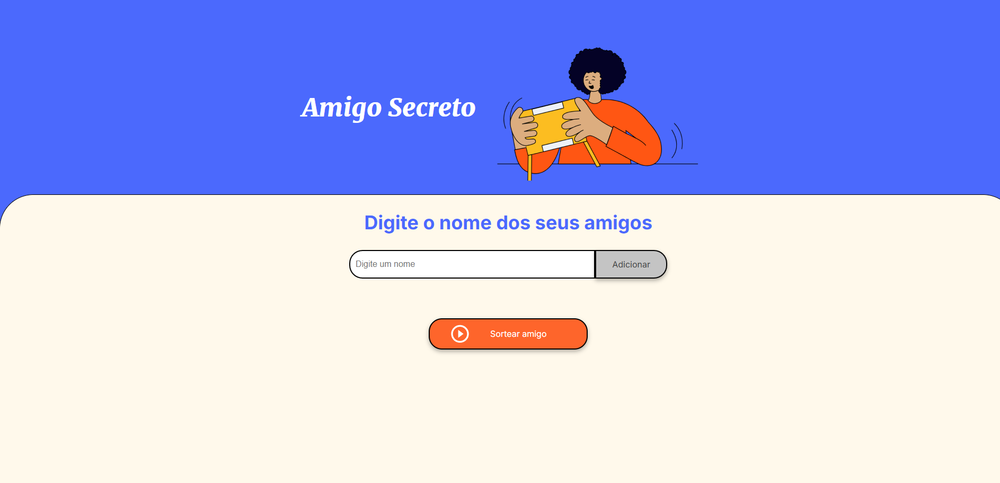

# Sorteio de Amigo Secreto


## Comentário Pessoal

> *"este projeto é um challenge da Alura para criar esse sorteio simples, fiz em conjunto com o curso basico de logica de programação da propria Alura, é meu primeiro programa que faço desde o inicio sem ajuda e me senti super realizado,
>  espero um dia olhar para esse codigo e perceber o quanto evolui. Espero que seja apenas o inicio dessa jornada na minha vida."*

---

## Screenshot do Projeto

Aqui está uma captura de tela do funcionamento do projeto:




---

Este programa permite adicionar nomes a uma lista e realizar um sorteio entre os amigos inseridos. A aplicação é simples, feita em JavaScript, HTML e CSS, e serve para gerar um sorteio de amigos secretos ou para qualquer outra situação em que você precise sortear aleatoriamente um nome de uma lista.

## Funcionalidades

- **Adicionar amigos à lista**: É possível adicionar nomes de amigos ao sorteio.
- **Exibir lista de amigos**: A lista de amigos adicionados é exibida na tela.
- **Sorteio de amigo secreto**: A partir da lista de amigos, o programa sorteia aleatoriamente um nome.
- **Validação de entrada**: O programa alerta caso você tente adicionar um nome vazio ou um nome que já esteja na lista.

## Como usar

1. **Adicione amigos**:
   - No campo de input, digite o nome de um amigo.
   - Clique no botão para adicionar o amigo à lista.
   - A lista será atualizada com o nome inserido.

2. **Sorteie um amigo**:
   - Após adicionar pelo menos 2 amigos à lista, clique no botão para realizar o sorteio.
   - O nome do amigo sorteado será exibido na tela.

## Código

O código JavaScript do programa é o seguinte:

```javascript
let listaAmigos = [];

function textoNaTela(id, texto) { // manipula um texto baseado no seu id.
    let campo = document.getElementById(id);
    campo.innerHTML = texto;
}

function limparInput() { // limpa o nome do campo de digitação após ser inserido na lista.
    let campoInserirNomes = document.querySelector('input');
    campoInserirNomes.value = '';
}

function adicionarAmigo() { // função que adiciona um nome a lista de nomes a serem sorteados.
    let inserirNomes = document.getElementById('amigo').value;
    let exibindoNomes = document.getElementById('listaAmigos');
    exibindoNomes.innerHTML += `<li>${inserirNomes}</li>`; // adiciona os nomes no html e exibe os nomes da lista na tela.
    
    if (inserirNomes == '' || listaAmigos.includes(inserirNomes)) { // verifica se existe um nome no campo e se o nome já existe na lista.
        inserirNomes == '' ? alert('Você não pode adicionar um nome vazio!') : alert('Esse amigo já está na lista!');  // para cada uma das 2 situações exibe um alerta.
        limparInput();
    } else {
        listaAmigos.push(inserirNomes);
        limparInput();
        console.log(listaAmigos);
    }
}

function sortearAmigo() { // sorteia um dos nomes que estão na lista.
    if (listaAmigos.length - 1 > 0) { // se existir pelo menos 1 nome na lista o sorteio é feito.
        let nomeSorteado = Math.floor(Math.random() * listaAmigos.length); // sorteia um número aleatório baseado na quantidade de nomes na lista.
        let nomeEscolhido = listaAmigos[nomeSorteado]; // armazena o nome sorteado (listaAmigos[indexador]).
        textoNaTela('resultado', `O nome sorteado foi: ${nomeEscolhido}`);
        textoNaTela('listaAmigos', '');
    } else {
        alert('Insira pelo menos 2 nomes antes de sortear');
    }
}
